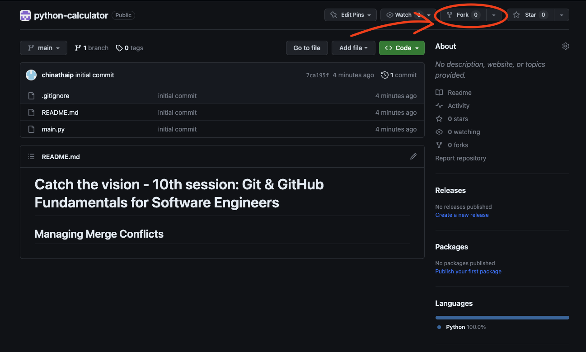
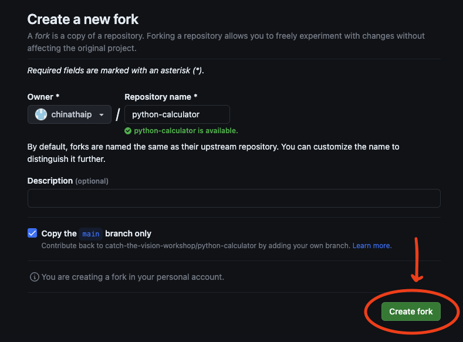
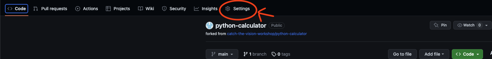
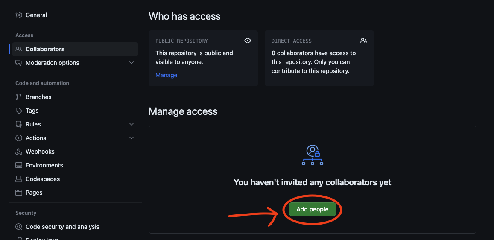

# Catch the vision - 10th session: Git & GitHub Fundamentals for Software Engineers :computer: :octocat:

   

## Managing Merge Conflicts :construction_worker: :collision:
Welcome to the Catch the Vision Workshop's Python Calculator repository! :wave: This workshop is designed to help participants learn Git through practical exercises focused on building a simple command-line calculator collaboratively. :people_holding_hands:

In this exercise, we will be managing merge conflicts. :monocle_face:

### What is a Merge Conflict? :grey_question:

Firstly, let's define what we mean by a merge conflict. :thinking: A merge conflict occurs when Git is unable to automatically resolve differences in code between two commits. When all the changes in the code occur on different lines or in different files, Git will successfully merge commits without your help. But if there are conflicting changes on the same lines, a "conflict" occurs because Git doesn’t know which code to keep and which to discard.

### Causes of Merge Conflicts :detective:

Merge conflicts typically occur when:

1. Several people have changed the same lines of the same file. :writing_hand:
2. One person decided to delete a file while another person decided to modify it. :file_folder: :x:
3. There are changes in the local branch which have not been committed yet, and those changes overlap with another branch's committed changes. :busts_in_silhouette:

### How to Resolve Merge Conflicts :hammer_and_wrench:

Resolving merge conflicts involves three steps:

1. **Identifying the conflict**: Git will mark the area in your code where conflict has arisen. It does so by enclosing the conflicting changes between `<<<<<<< HEAD` and `=======`, and ends with `>>>>>>> branch-name`.

2. **Reviewing the conflict**: Analyze the code and determine which parts you want to keep and which parts to discard. This step requires communication between the developers involved in the conflict. :speech_balloon:

3. **Resolving the conflict**: Once the desired changes are chosen, manually edit the code to resolve the conflict, remove the conflict markers, and save the file. :memo:

After resolving the conflict, commit the resolved file to finalize the merge. :white_check_mark:

### Exercise: Managing Merge Conflicts :muscle:

Now, let's put this into practice. :rocket:

For this exercise, each of you will receive a piece of paper with the complete `main.py` file's code except for five missing functions. Your task is to collaboratively add these missing functions to the top of the `main.py` file and integrate it into the current file. But here's the twist:

1. **Commit Requirements**: Make sure there are at least four commits in the process.
2. **Team Collaboration**: Each team member should contribute at least one commit.
3. **Unique Contributions**: Each function insertion commit must be contributed by a different team member.
4. **Code Execution**: Ideally, the resulting `main.py` file should run successfully. This, however, is optional and not a strict requirement for this exercise.

#### Step 1: Fork the Repository

First, one of the team members needs to fork the repository. This creates a copy of the repository under their own account, allowing you to make changes without affecting the original repository.



#### Step 2: Add Collaborators

Once the repository has been forked, the team member who forked it needs to add the rest of the team as collaborators. This can be done through the settings of the repository on GitHub.



#### Step 3: Clone the Repository

Now, every team member can clone the forked repository to their local machines:

```bash
$ git clone <forked-repository-url>
```

#### Step 4: Add the Missing Function

Once you have the repository on your local machine, open the `main.py` file and add the missing function to the top of the file. Save your changes.

#### Step 5: Commit the Changes

After you've added the function, commit the changes with a meaningful commit message:

```bash
$ git add main.py
$ git commit -m "Added <function-name> to main.py"
```

#### Step 6: Push the Changes to the Remote Repository

Now, push your changes to the remote repository:

```bash
$ git push origin main
```

#### Step 7: Resolve Merge Conflicts

If Git indicates a merge conflict when you try to push your changes, you'll need to pull the latest version of the code:

```bash
$ git pull origin main
```

Git will likely tell you that there are conflicts that need to be resolved. Open the `main.py` file, find the conflict (marked with `<<<<<<< HEAD`, `=======`, and `>>>>>>> branch-name`), and decide which changes to keep.

Once you've resolved the conflict, remove the conflict markers, save the file, and then commit it:

```bash
$ git add main.py
$ git commit -m "Resolved merge conflict in main.py"
$ git push origin main
```

Repeat this process until all the missing functions are added and all merge conflicts are resolved. By the end of this exercise, you'll have a working `main.py` file with all the missing functions added by different team members, and more importantly, you'll have gained hands-on experience in managing merge conflicts. Happy coding! :computer: :wrench: :bulb: